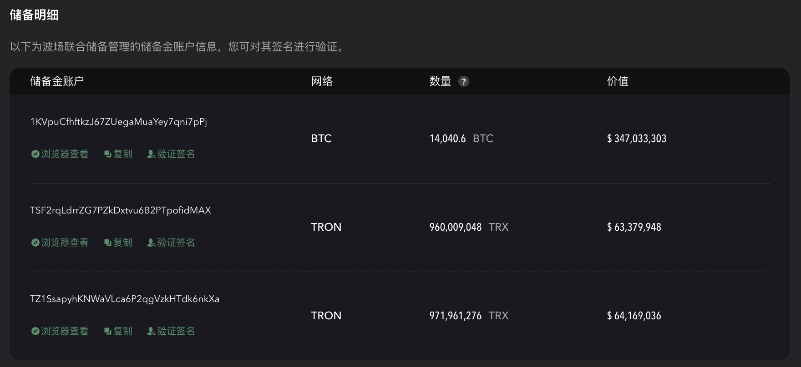

# 透明度

通过多种主流加密货币（包括 BTC, USDT, USDC, 和 TRX.）的超额背书担保，确保了 USDD 自身的稳定性和安全性。

最新的储备信息和抵押率可从 [https://usdd.io/#/](https://usdd.io/#/) 或 [https://tdr.org/#/](https://tdr.org/#/) 获取。

## 储备明细

### TRX 销毁明细

以下为波场联合储备管理的 TRX 销毁信息。

| TRX 销毁合约                                                                                                | 数量               | 价值            |
| ------------------------------------------------------------------------------------------------------- | ---------------- | ------------- |
| [TNMcQVGPzqH9ZfMCSY4PNrukevtDgp24dK](https://tronscan.org/#/address/TNMcQVGPzqH9ZfMCSY4PNrukevtDgp24dK) | 8,997,566,086TRX | $ 725,332,043 |

### 储备明细与抵押率

#### 从 USDD 主页获取储备明细与抵押率

1. 进入网址 [https://usdd.io/#/](https://usdd.io/#/)，下拉至 **透明度** 部分，即可在右下角查看抵押率。

<figure><figcaption>
截图时间：2023年3月16日
</figcaption></figure>

2. 点击左下角的 **质押明细** 按钮，进入弹出窗口，下拉即可查看储备明细。

<figure><figcaption>
截图时间：2023年3月16日
</figcaption></figure>

#### 从 TDR 主页获取储备明细与抵押率

1. 进入网址 [https://tdr.org/#/](https://tdr.org/#/)，下拉至 **透明度** 部分，即可在右下角查看抵押率。

<figure><figcaption>
截图时间：2023年3月16日
</figcaption></figure>

2. 点击左下角的 **质押明细** 按钮，进入弹出窗口，下拉即可查看储备明细。

<figure><figcaption>
截图时间：2023年3月16日
</figcaption></figure>

### 签名

<table><thead><tr><th width="200">地址</th><th>网络</th><th>消息</th><th>签名</th></tr></thead><tbody><tr><td>1KVpuCfhftkzJ67ZUegaMuaYey7qni7pPj</td><td>BTC</td><td>trondaoreserve</td><td>IJCF8Myp5NCirj4kc9NAChZAqt2p2SM9yOzvvUcJyS1NZpE9HQAIlA/mviXuAcYQNiAYFKGtMXVDe2QzQ0WHspI=</td></tr><tr><td>TSF2rqLdrrZG7PZkDxtvu6B2PTpofidMAX</td><td>TRON</td><td>trondaoreserve</td><td>829fd880823414918e97aaa23698ee2f6211c46aec3c82191a5c653f3d0bab7c09ae7b23a7cb369e299f4afd169a518579697b41779153b919b584a94e606d3b01</td></tr><tr><td>TZ1SsapyhKNWaVLca6P2qgVzkHTdk6nkXa</td><td>TRON</td><td>trondaoreserve</td><td>779303d66a40fed8f08585c36c495520fbad0bfade3116f3c9b3d4fcbe6f65630ade6b10a4bf4e565babc30ae20914f0a0dadb9e54d8dbb73931a0c64c665cab00</td></tr></tbody></table>

## 如何验证签名？

#### BTC 储备金账户请按以下流程进行签名验证：

1\. 在上方表格找到需要验证的储备金账户点击“验证签名”查看签名信息；

2\. 打开 ["Bitcoin.com"](https://www.bitcoin.com/tools/verify-message/)，填入签名信息中的 Bitcoin Address、Message、Signature 即可验证。

#### TRON 储备金账户请按以下流程进行签名验证：

1\. 在上方表格找到需要验证的储备金账户点击“验证签名”查看签名信息；

2\. 打开 ["TRONSCAN"](https://tronscan.org/#/tools/verify-sign/)，填入签名信息中的 Address、Message、Signature，点击“Verify Signature”即可验证。

