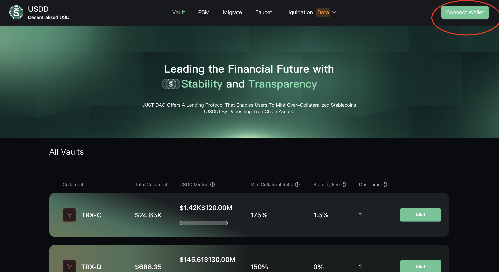

# sUSDD Mechanism

**sUSDD** is the yield-bearing version of USDD. Its core mechanism is based on the **ERC-4626 tokenized vault standard.** When users deposit and stake USDD into the USDD Earn protocol, sUSDD is minted and distributed according to the current exchange rate.

#### Core Mechanism & Value Accumulation

The value growth of sUSDD stems from its unique redemption mechanism, which reflects the dynamic relationship between total USDD staked and accumulated rewards. The minting and valuation formulas are as follows:

<figure><figcaption></figcaption></figure>

**Dynamic value growth**

* At any moment, the **sUSDD-to-USDD** value serves as the key metric for tracking cumulative yield performance.
* As USDD continues to accrue returns via the **Smart Allocator** strategy, the value of sUSDD steadily increases over time.
* This ensures that holders of sUSDD directly benefit from the yield strategy, reflected in the token’s appreciating value. 

#### Liquidity & Redeemability

* Each sUSDD is **fully redeemable** for USDD at any time.
* USDD deposited is **never locked**, and withdrawals from sUSDD incur **no liquidity restrictions**.

#### ERC-4626 Standard

sUSDD is an ERC-4626-compliant **tokenized vault** designed for EVM-compatible blockchains. This standard enhances **DeFi composability and interoperability**.

**Key Advantages of ERC-4626:**

* **Standardized API** – Provides a unified interface for managing yield-bearing assets efficiently.
* **Transparent & Efficient Yield Distribution** – Ensures fair and transparent allocation of returns to staked USDD holders.
* **Simplified Integration** – Facilitates future integration of sUSDD with broader DeFi protocols, improving UX and security.

#### sUSDD Yield Mechanism Operation

sUSDD leverages an **ERC-4626 vault** to distribute yields. This standard ensures **transparent and efficient yield allocation** while providing a solid foundation for integration into broader DeFi applications.
