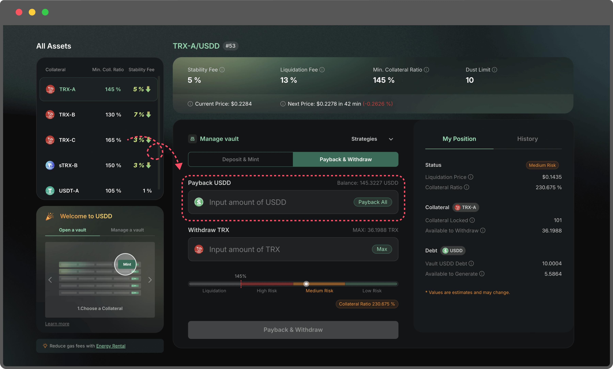

# Close a Vault

1. **Navigate to the Vault page**

Go to the Vault section and locate the active Vault you wish to close.

2. **Connect Your Wallet**

Connect your wallet to the platform. 

Ensure your wallet has enough TRX to cover the gas fees required for repayment and collateral withdrawal.

<figure><figcaption></figcaption></figure>

3. **Review Your Vault Status**

Before closing your Vault, check:

* The outstanding USDD debt
* Your collateral balance
* Your current collateral ratio

Make sure you have enough USDD in your wallet to fully repay the debt.

<figure><figcaption></figcaption></figure>

4. **Repay all borrowed USDD**

Navigate to the Payback & Withdraw tab

<figure><figcaption></figcaption></figure>

In the Payback field, click Payback All or enter the full debt amount.

<figure><figcaption></figcaption></figure>

5. **Withdraw all your collateral**

In the Withdraw field, click Max or enter the full collateral amount.

<figure><figcaption></figcaption></figure>

6. **Confirm Transaction**&#x20;

Click Payback All & Withdraw, confirm the transaction in your wallet.

<figure><figcaption></figcaption></figure>

Once completed, your Vault debt will be zero, and all collateral will be returned to your wallet.

<figure><figcaption></figcaption></figure>

**Note:**

If you don’t have enough USDD, you can:

* Swap USDD via the PSM (Peg Stability Module)
* Or purchase USDD from exchanges

