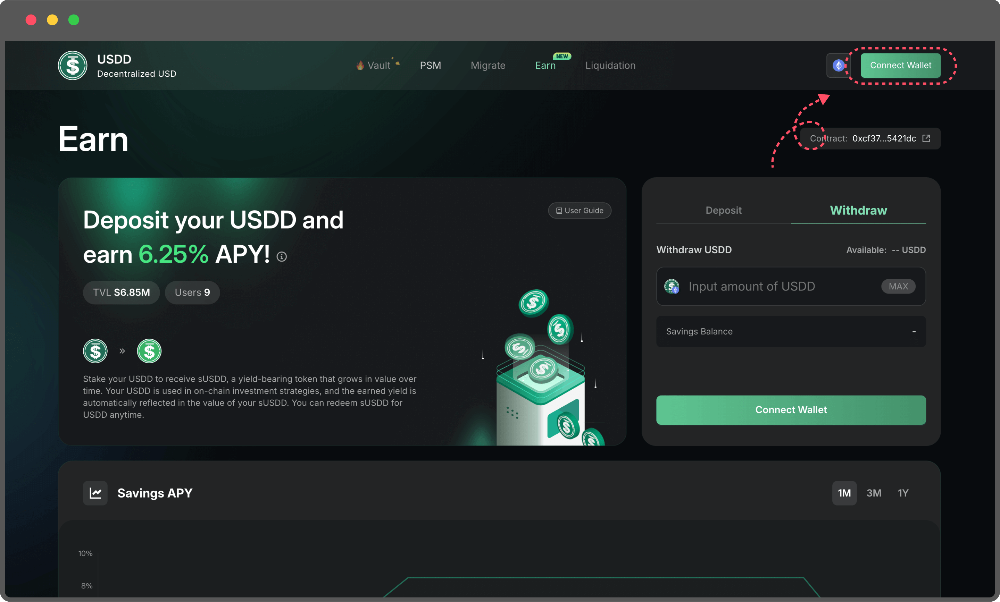
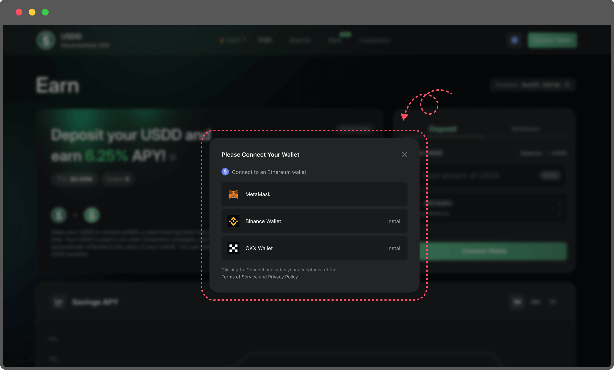
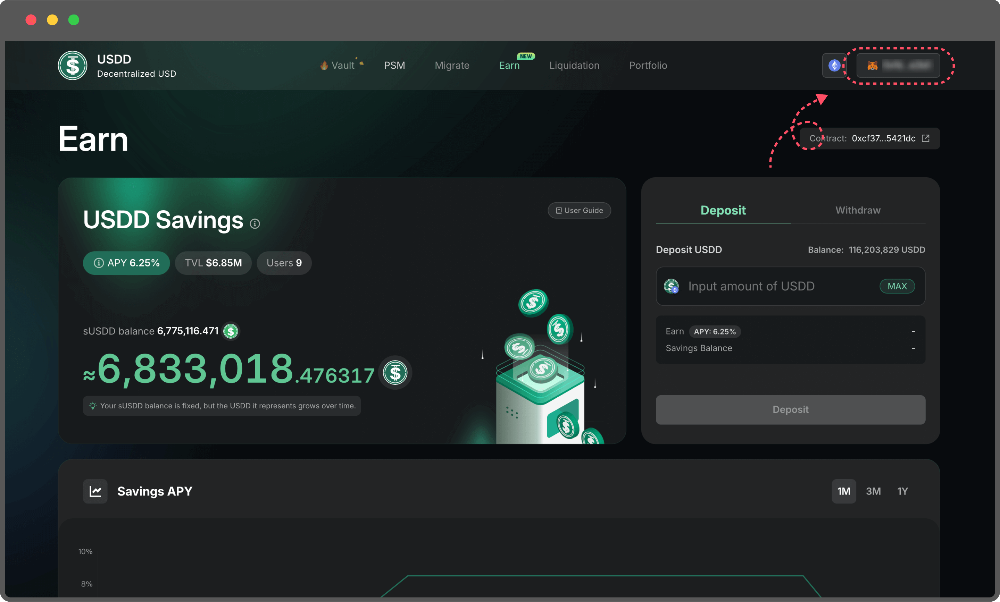
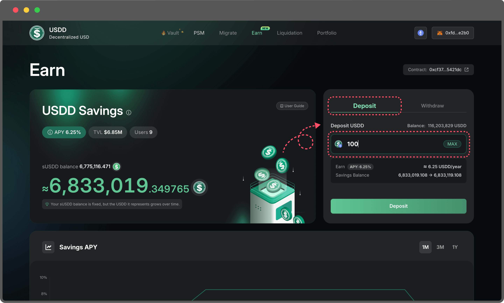
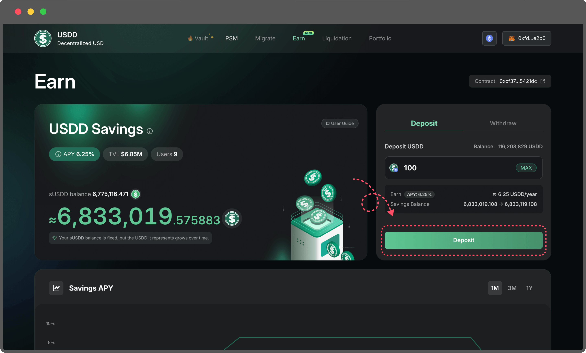
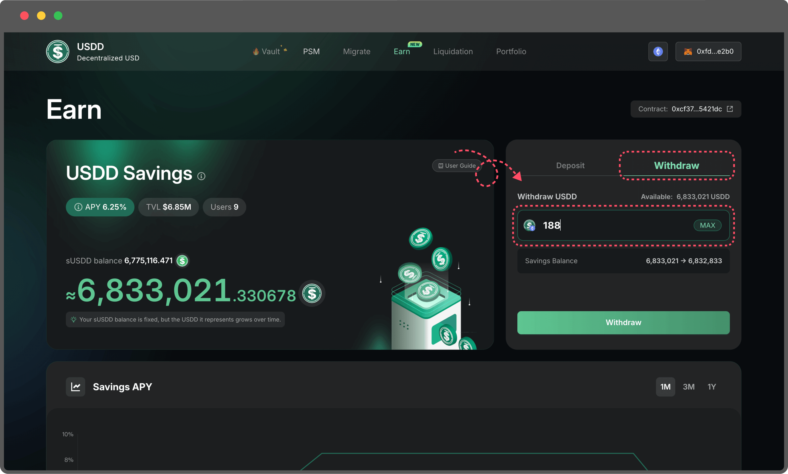
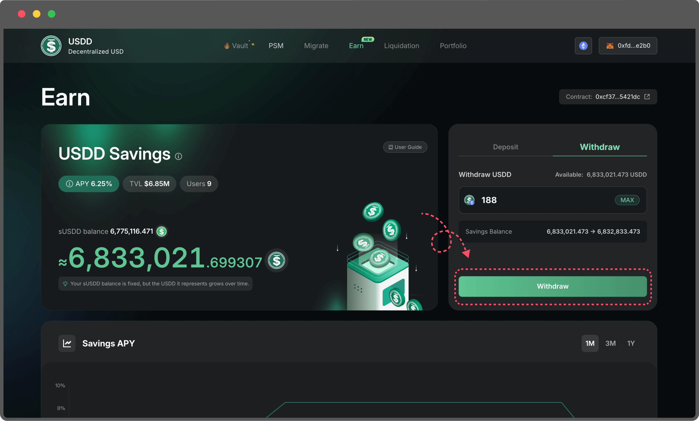
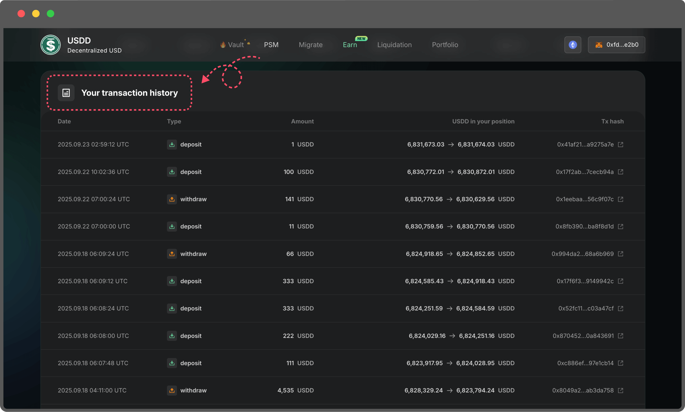

# Getting sUSDD

This guide explains how to stake USDD to earn yield through sUSDD. By connecting your wallet, depositing USDD, and receiving sUSDD as proof of stake, you can start earning interest automatically. You can withdraw your funds at any time without a lock-up period.

### &#x20;1. Connect Your Wallet

* On the Earn page, select the Ethereum network.

<figure><figcaption></figcaption></figure>

* Click **Connect Wallet** in the top-right corner.

<figure><figcaption></figcaption></figure>

* Choose your wallet from the popup.

<figure><figcaption></figcaption></figure>

* Once connected, your wallet address will appear on the page.

<figure><figcaption></figcaption></figure>

### 2. Deposit USDD

* Under Deposit, enter the amount of USDD you want to stake (cannot exceed your wallet balance).

<figure><figcaption></figcaption></figure>

* Click Approve/Deposit and confirm the transaction in your wallet.

<figure><figcaption></figcaption></figure>

* Once the transaction is confirmed:
  * You will see your sUSDD balance on the left side of the page.
  * The corresponding USDD value of your sUSDD will also be displayed.

<figure><figcaption></figcaption></figure>

* Over time, the USDD value of your sUSDD increases automatically, reflecting your earned yield.

### 3. Withdraw USDD

* Under Withdraw, enter the amount of USDD you want to withdraw.

<figure><figcaption></figcaption></figure>

* Click Withdraw and confirm the transaction in your wallet.

<figure><figcaption></figcaption></figure>

* After confirmation, your sUSDD will be burned, and you will receive the corresponding amount of USDD in your wallet.
* You can view all your actions in your transaction history.

<figure><figcaption></figcaption></figure>

### ✅ Notes

* There is no lock-up period — you can withdraw anytime.
* When withdrawing, you will receive your initial deposit plus the accumulated yield.
