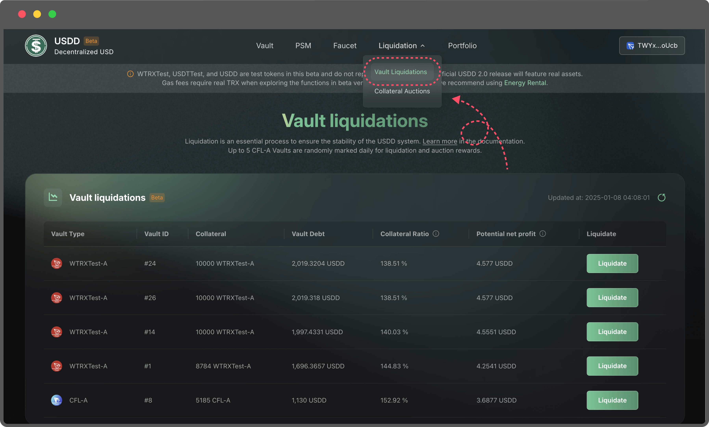
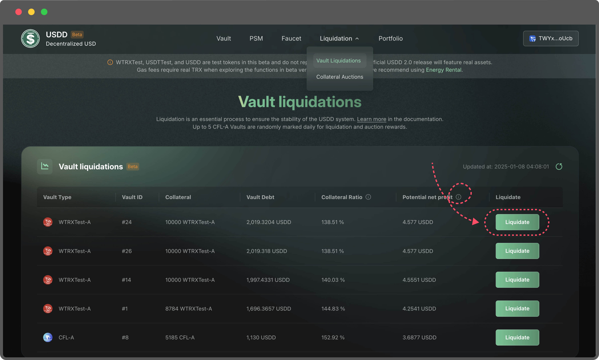
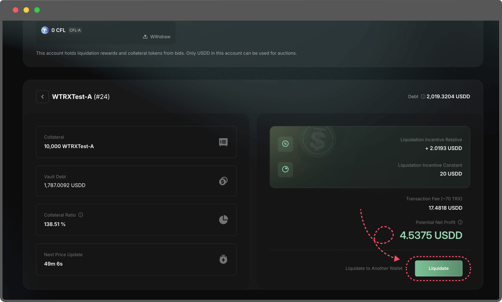

# Liquidation

When a Vault's Collateralization Ratio falls below the Min. Collateral Ratio, it becomes eligible for liquidation. This process plays a critical role in maintaining the stability and efficiency of the USDD ecosystem. By participating in liquidations, users can earn rewards while contributing to the system's health.

#### Steps to Participate in Liquidation

1.  **Navigate to the Liquidation Page**\
    Visit the Liquidation Page to view Vaults eligible for liquidation.

    <figure><figcaption></figcaption></figure>
2.  **Review Vault Details**\
    Each Vault's detailed information, including its debt and collateral status, is available on the liquidation page. This helps users make informed decisions before initiating a liquidation.

    <figure><figcaption></figcaption></figure>
3. **Earn Liquidation Rewards**\
   Users who trigger a liquidation will receive a reward. Rewards are distributed based on the following formula: **Potential Net Profit = Liquidation Incentive (Relative) + Liquidation Incentive (Constant) - Transaction Fee**
   1. Liquidation Incentive (Relative): This reward component is proportional to the debt of the liquidated Vault.
   2. Liquidation Incentive (Constant): A fixed reward for successfully liquidating a Vault.
   3.  Transaction Fee: The estimated gas fee for completing the transaction. The actual fee can be verified later using a blockchain explorer.

       <figure><figcaption></figcaption></figure>
4. Choose Reward Address:
   1. Rewards can be sent to your currently connected wallet.
   2. Alternatively, you can specify a different address to receive the rewards.
5.  Withdraw Rewards：

    The rewards from liquidations are stored in the liquidation auction account. Users can withdraw these rewards to their wallets as part of the liquidation process.

#### Key Benefits

* Helps maintain system stability by resolving under-collateralized Vaults.
* Provides users with tangible incentives for their participation.
