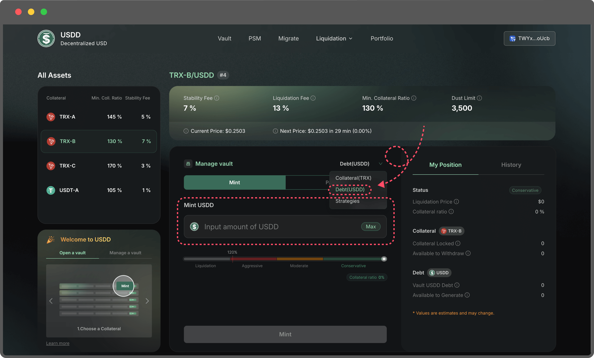
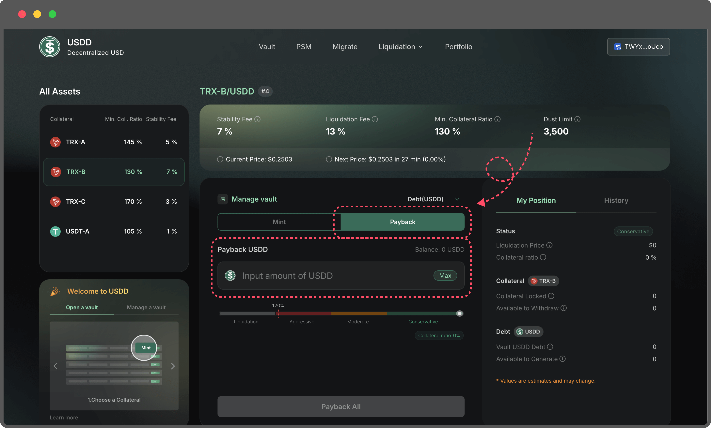
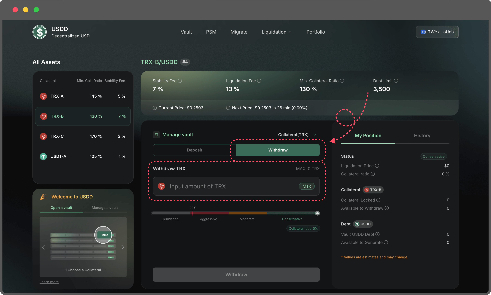

# Manage a Vault

If you’ve already **opened a Vault**, you can manage it through various actions to optimize its performance and mitigate risks. Below is a detailed guide for managing your Vault:

1. **Add Collateral**

Adding more collateral to an existing Vault increases the Collateralization Ratio, reducing the risk of liquidation.

* Enter the amount of collateral you wish to deposit.
*   The updated collateralization ratio and other key metrics will be displayed on the right side of the page, providing a clear view of how this action affects your Vault's stability.

    <figure><figcaption></figcaption></figure>

**2. Mint More USDD**

If you need additional liquidity, you can mint more USDD from your Vault.

* Enter the desired amount of USDD to mint, staying within the allowable range to avoid errors.
*   Caution: Minting more USDD decreases the Collateralization Ratio, increasing the risk of liquidation. If the ratio falls below the Min. Collateral Ratio, your Vault may be liquidated to cover the debt.

    <figure><figcaption></figcaption></figure>

**3. PayBack USDD**

If you have surplus USDD, you can repay part or all of your Vault debt.

* Reducing your debt increases the Collateralization Ratio, significantly lowering the risk of liquidation.
*   This is a useful option if you aim to stabilize your Vault or reduce exposure to potential market volatility.

    <figure><figcaption></figcaption></figure>

**4. Withdraw Collateral**

If your Vault is well-collateralized and not at risk of liquidation, you may withdraw a portion of your collateral.

* Enter the amount you wish to withdraw.
*   Caution: Withdrawing collateral reduces the Collateralization Ratio, potentially bringing your Vault closer to the Min. Collateral Ratio. Monitor the updated metrics carefully before proceeding.

    <figure><figcaption></figcaption></figure>

**Risk Management Tips:**

*   Always maintain a healthy **Collateralization Ratio (CR)** above the **Min. Collateral Ratio (MCR)** to avoid liquidation. Your position falls into one of four categories:

    * **Conservative:** Your CR is well above the MCR, providing a strong safety buffer.
    * **Moderate**: Your CR is above the MCR, but the buffer is smaller—monitor your position closely.
    * **Aggressive:** Your CR is near the MCR, putting your Vault at high risk of liquidation. Take immediate action to top up your collateral or reduce your debt.
    * **Liquidation**: Your CR has fallen below the MCR, and your Vault is being liquidated.

    To minimize risk, aim to stay within the Conservative or Moderate ranges, and avoid the Aggressive zone by actively managing your Vault.
* Regularly review your Vault's status, especially during periods of market volatility.
* Consider repaying USDD or adding more collateral if your Vault's ratio approaches the Min. Collateral Ratio.

These management tools allow you to maintain flexibility while keeping your Vault secure and optimized for your financial goals.
