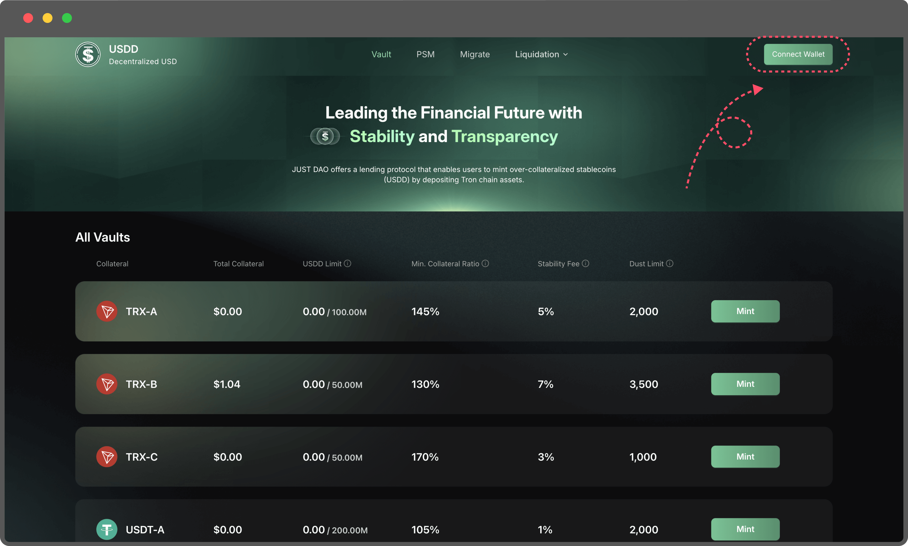
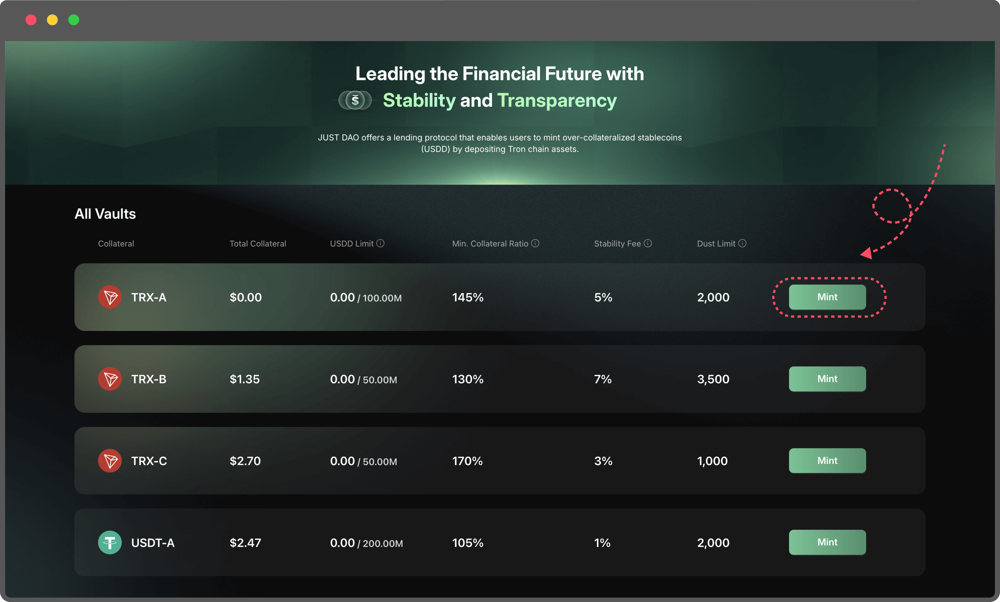
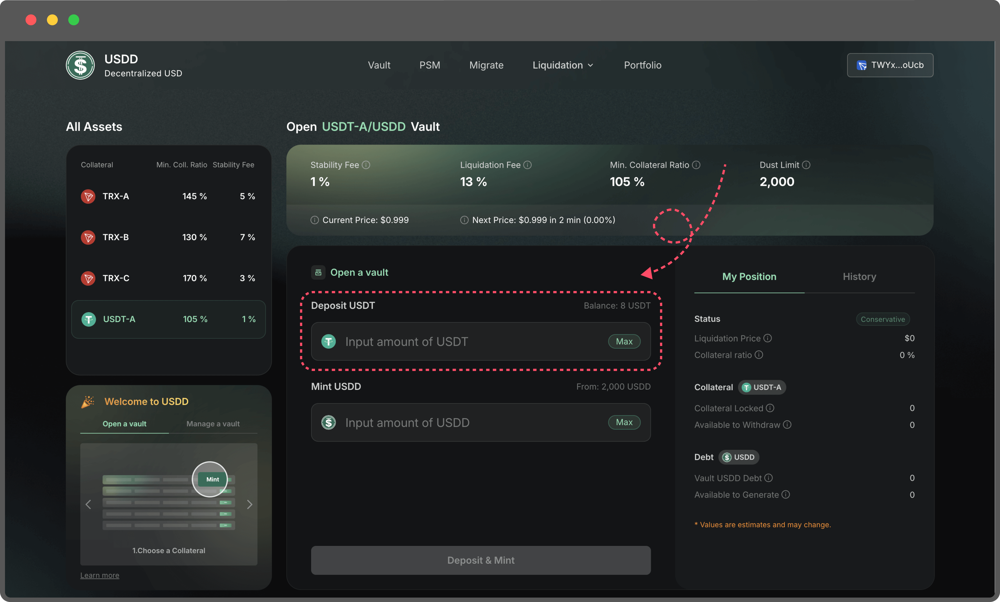
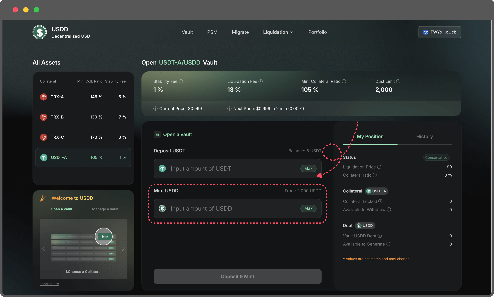

# Open a Vault

1. **Navigate to the Vault page**
2. **Connect Your TronLink Wallet**
   1. Begin by linking your TronLink wallet to the platform. This wallet will serve as your interface for managing collateral and minting USDD.
   2.  Ensure your wallet has sufficient TRX to cover the gas fees for transactions.

       <figure><figcaption></figcaption></figure>
3.  **Select a Collateral Type**

    Choose the type of collateral you want to deposit from the available options. Each collateral type may have different stability fees and liquidation thresholds, so select the one that best suits your strategy.

    <figure><figcaption></figcaption></figure>
4. **Input Collateral Amount**
   1. Enter the amount of collateral you wish to deposit into the Vault. Make sure the amount does not exceed the balance available in your TronLink wallet.
   2.  Double-check your wallet balance to avoid transaction errors.

       <figure><figcaption></figcaption></figure>
5. **Enter the Amount of USDD to Mint**
   1. Specify the amount of USDD you’d like to mint. The system will automatically calculate the maximum mint amount based on your collateral and the current market conditions.
   2. If the collateral you’re staking is not TRX, you may need to complete an approve transaction before proceeding.
   3. Minting a smaller amount of USDD results in a higher collateral ratio, making your Vault safer from liquidation.
   4.  Minting a larger amount of USDD decreases your collateral ratio, increasing the risk of liquidation if the collateral value drops.

       <figure><figcaption></figcaption></figure>

**Pro Tips for Managing Your Vault：**

* Regularly monitor your collateral ratio to ensure it stays above the liquidation threshold.
* Keep an eye on market prices for your collateral, as fluctuations could impact the safety of your Vault.
* Use the platform’s portfolio tools to track your transactions and manage your positions efficiently.
* If you’re new to the system, you’ll be prompted to create a proxy. Don’t worry—this process is straightforward, and step-by-step guidance will help you complete it in just a few clicks.
