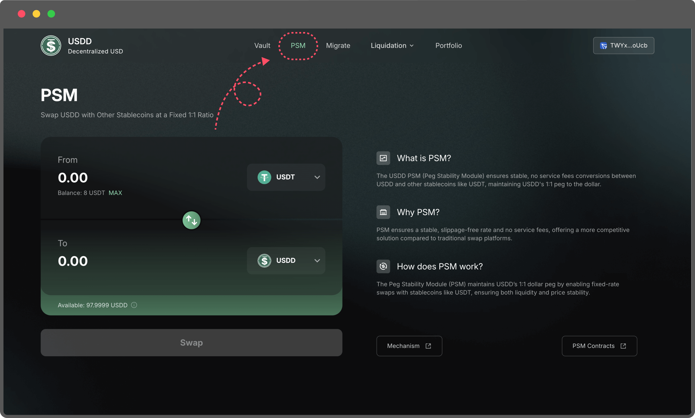
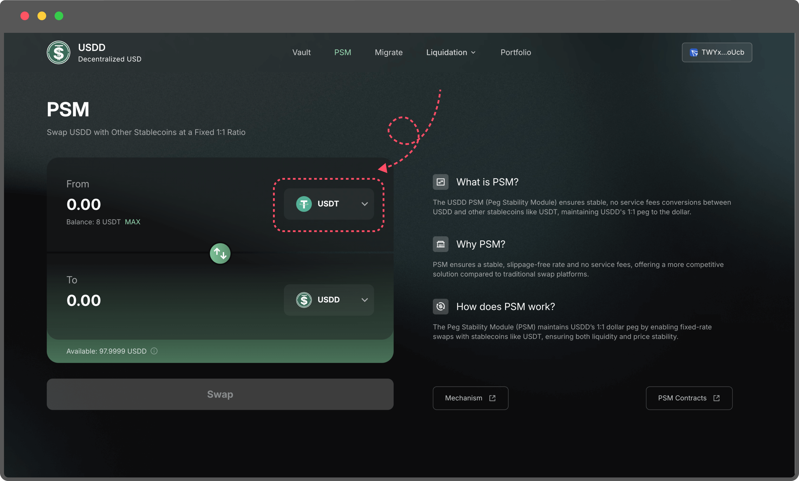
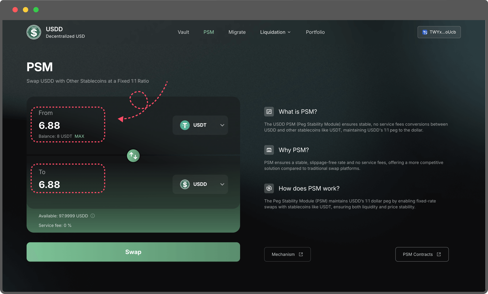

# PSM

To perform stablecoin-to-USDD conversions, navigate to the PSM page.

<figure><figcaption></figcaption></figure>

PSM is USDD’s built-in fixed-rate swap feature that lets you convert between USDD and supported stablecoins at a predictable 1:1 rate. It’s designed to keep USDD stable while giving users a simple, transparent way to move in and out of USDD.

#### How to Use the PSM

1.  **Select the Stablecoin:** On the PSM page, choose the token you want to exchange for USDD or vice versa.

    <figure><figcaption></figcaption></figure>
2.  **Enter the Token Amount**: Input the amount of tokens you wish to swap. The transaction requires no service fees; however, ensure your wallet has enough TRX to cover the gas fees for the transaction.

    <figure><figcaption></figcaption></figure>
3. **Check Availability:** The "Available" section displays the quantity of the target token currently available for exchange. Ensure your swap amount does not exceed the available limit.

The PSM feature is designed for ease of use, offering fast and secure conversions without slippage, making it an essential tool for users seeking to maintain the 1:1 USDD peg while interacting with other stablecoins.
