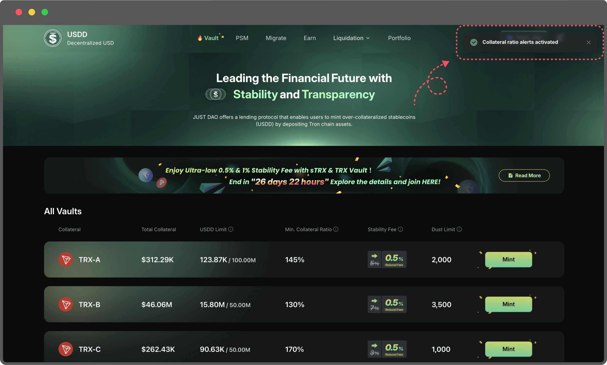

# Risk Alert

To help users better manage their collateralized positions, USDD has officially launched the Risk Alert feature. With Risk Alert, you’ll be notified the moment your position approaches the liquidation threshold, allowing you to take timely action and avoid unnecessary losses.

**Key Features**

* Dual-channel notifications: On-page alerts + Email notifications
* Wallet signature verification: No gas fee required
* Quick and easy email binding
* Instant alerts for high-risk positions to help prevent liquidation

**How to Enable Risk Alerts**

Just 6 simple steps to enable email risk alerts:

Step1: Visit [https://app.usdd.io/](https://app.usdd.io/) and connect your wallet.

<figure><figcaption></figcaption></figure>

Step2:&#x20;

* Click the bell icon in the top right corner. 🔔
* Then, sign the smart contract to authorize access to the Risk Alert interface. This signature simply verifies ownership of your wallet address—no gas fees will be charged.

<figure><figcaption></figcaption></figure>

Step3: Connect and sign with your wallet

* You’ll be prompted to sign a message with your wallet.
* The signature is only used to verify ownership of the address—no gas fee will be charged.
* After signing, you’ll proceed to the next step.

<figure><figcaption></figcaption></figure>

Step4: Turn on Risk Alert

* Switch on the risk alert toggle to start receiving notifications.

<figure><figcaption></figcaption></figure>

Step5: Enter your email address

* Use a frequently checked email to receive timely alerts.
* Your email will only be used to send risk notifications.

<figure><figcaption></figcaption></figure>

Step6: Enter the verification code to complete the binding

* A one-time code will be sent to your email.
* Enter the code to finish binding your email to your wallet.

<figure><figcaption></figcaption></figure>

Once binding is complete, you can return to the same page anytime to turn email alerts on or off.

<figure><figcaption></figcaption></figure>

**Two Types of Risk Alerts**

1. On-Page Alerts (Always Active)

Risk warnings will automatically appear at the top of the page based on your Vault’s Collateral Ratio:

* **High Risk Alert**: Collateral Ratio is less than **5%** above the liquidation line
* **Moderate Risk Alert**: Collateral Ratio is less than **10%** above the liquidation line

No setup needed—alerts are always active and update in real time to keep you informed.\
\

2\. Email Alerts (Manually Toggle On/Off)

* When enabled, the system will send an alert email whenever a risky position is detected.\
  Perfect for users who are not always on the page—ensuring you receive important updates anytime, anywhere.
* You can manage this feature anytime through the bell icon in the top right corner.
* **High Risk Alert**: Collateral Ratio is less than **5%** above the liquidation line
* **Moderate Risk Alert**: Collateral Ratio is less than **10%** above the liquidation line
